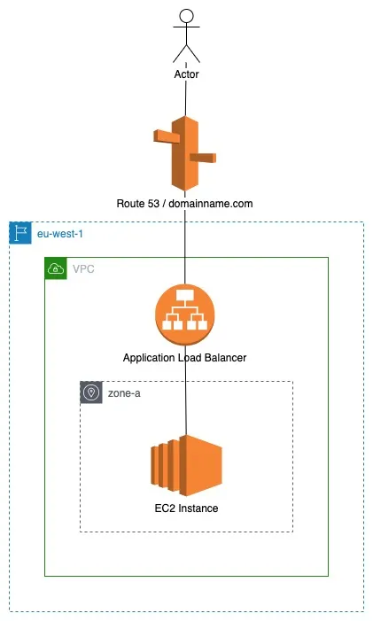

# Here is some basics of Terraform #

## Create AWS Resources with Terraform Test ##

## References

[Tutorials by Hashicorp](https://developer.hashicorp.com/terraform/tutorials/aws-get-started/infrastructure-as-code)

